#Final Project Work Log

##My TItle Of Final 'Meet Myself Through Shout'

“Meet Myself Through Shout” is an interactive artwork about letting out your feelings by using your voice. In today’s world, many people keep their stress inside and hide their true emotions. This project turns that hidden feeling into sound and visuals. When users shout into the microphone, the screen slowly changes from a blurry image to a clear one, showing their real self. It gives people a digital space to express emotions freely and feel relief through sound, mixing art, technology, and emotion.
 
#Process Of My Fianl

##Project1: Applying mosaic effects based on microphone input levels(Good)

###In this process, I will create a mosaic effect and make it disappear as the microphone input gets louder.

I made this using p5.js, and I checked the reference site to create a camera, but it was hard to find, so I asked ChatGPT.

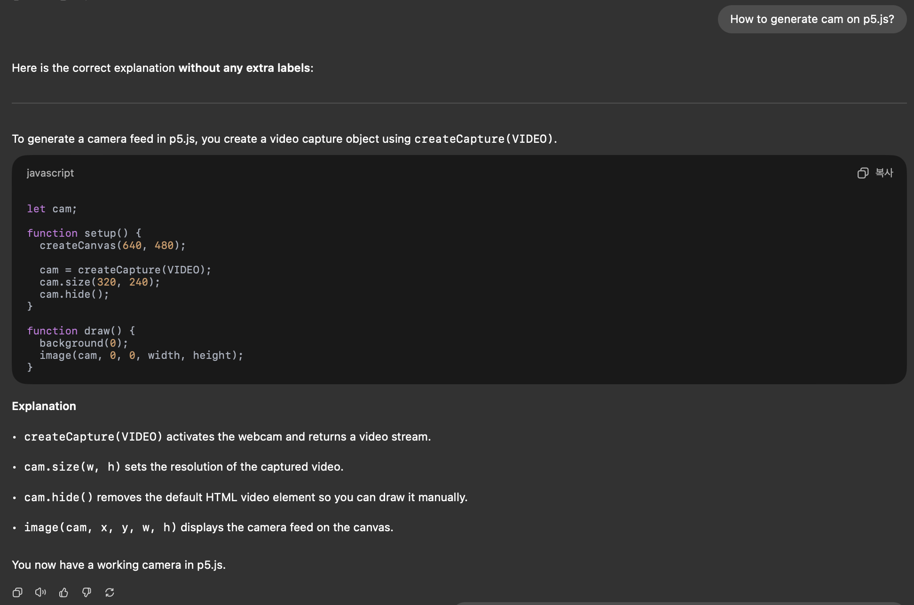

However, the generated camera acted like a mirror, my image didn’t move naturally and it moved in the opposite direction of my actual movement. So I used push and pop codes.
 
`
let cam;
function setup() {
  createCanvas(640, 480);
  cam = createCapture(VIDEO);
  cam.size(640, 480);
  cam.hide();
}
function draw() {
  background(0);
  push(); 
  scale(-1, 1);
  pop();
}
`

But it didn't work. So I asked Chat gpt, and I realized that I forgot 'traslate'.

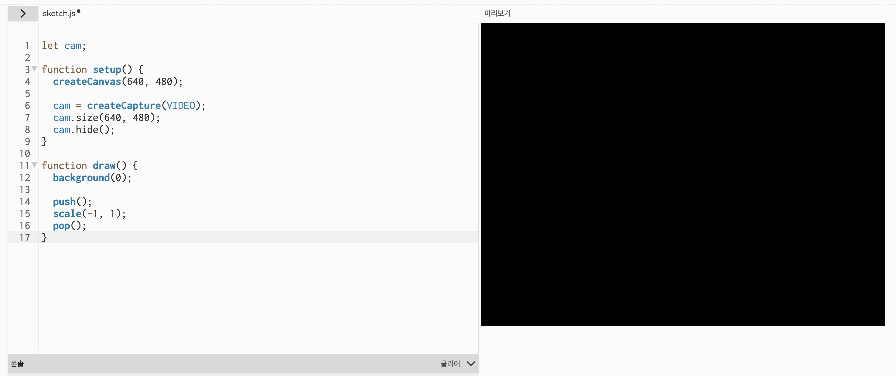

And I could learn that I should add 'image' code to designate the object. Finally it worked!

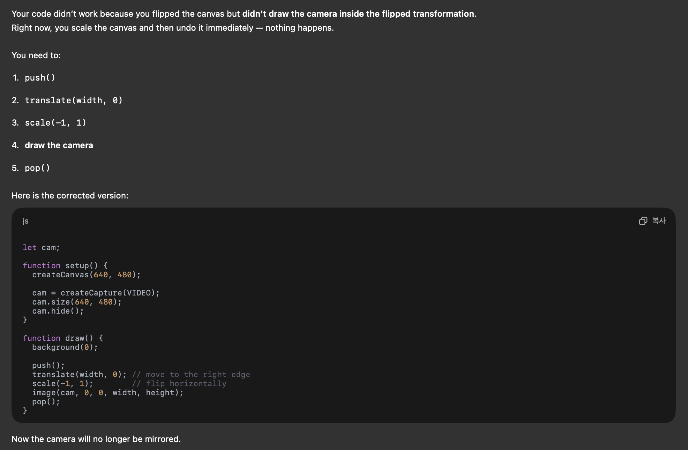

I looked up several references to implement a mosaic effect, but I still couldn’t figure it out, so I asked ChatGPT.

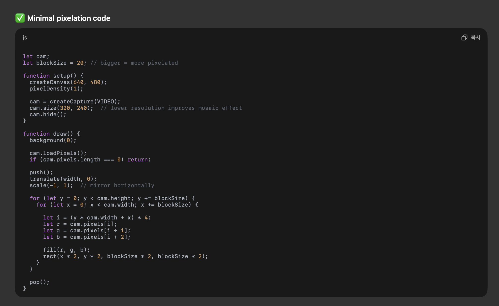

I understood the basic idea, but I didn’t fully grasp how it works.

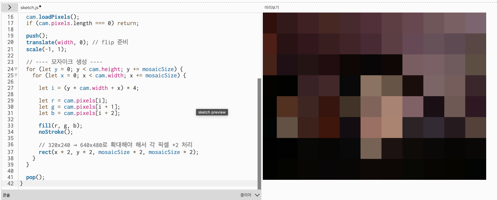

To input the microphone signal, I used code I found in the p5.js reference.

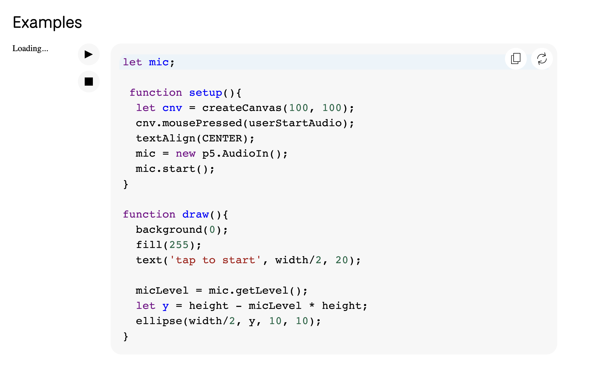

`
mic = new p5.AudioIn();
mic.start();
`

I wanted the mosaic to clear up as the microphone signal increased, and for it to disappear completely once it reached a certain volume. However, I couldn’t find any reference that explained how to do this, so I asked ChatGPT.

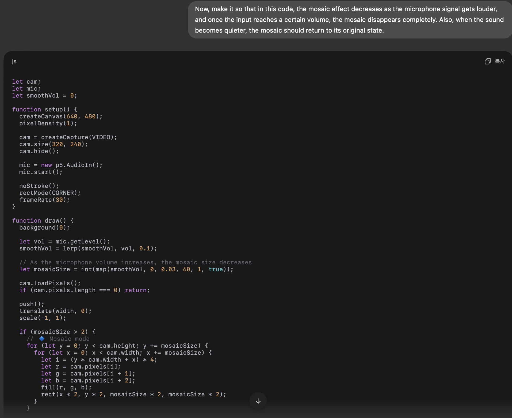

This was very difficult to understand, and to be honest, I still don’t fully understand it. And the maximum volume at which the mosaic disappeared was too low, so I adjusted it to a more appropriate level.

###Through this process, I realized how the mosaic effect is generated. And I think I’ll be able to create interactive art on my own from now on.

##Project 2: Generating background music(Better)

###In this process, I will create a mosaic effect and make it disappear as the microphone input gets louder.

First, I searched the reference site to see how sound is generated. I will use only three sine waves that are comfortable to listen to, similar to a drone sound.

What I realized from looking at this reference is that I need to set the waveform first, then the frequency, and finally the output level. And then I tried it exactly as the reference showed. I named the background music oscillator ‘bgOsc.’ and I used the following code and played the frequency corresponding to C3, and it worked properly.

`
let bgOsc
bgOsc = new p5.Oscillator('sine');
bgOsc.freq(130.81);
bgOsc.amp(0.2)
`

I added additional frequencies and created the following code to make it easy to understand. 

`
let cam;
let mic;
let smoothVol = 0;
let bgOsc1, bgOsc2, bgOsc3;
function setup() {
  createCanvas(640, 480);
  pixelDensity(1);
  cam = createCapture(VIDEO);
  cam.size(320, 240);
  cam.hide();
  mic = new p5.AudioIn();
  mic.start();
  noStroke();
  rectMode(CORNER);
  frameRate(30);
  // bgOsc only
  bgOsc1 = new p5.Oscillator('sine');
  bgOsc2 = new p5.Oscillator('sine');
  bgOsc3 = new p5.Oscillator('sine');
  bgOsc1.freq(130.81);
  bgOsc2.freq(293.66);
  bgOsc3.freq(493.88);
  bgOsc1.amp(0.03);
  bgOsc2.amp(0.025);
  bgOsc3.amp(0.02);
  bgOsc1.start();
  bgOsc2.start();
  bgOsc3.start();
}
function draw() {
  background(0);
  let vol = mic.getLevel();
  smoothVol = lerp(smoothVol, vol, 0.1);
  // sound → mosaic decreasing
  let mosaicSize = int(map(smoothVol, 0, 0.3, 60, 1, true));
  cam.loadPixels();
  if (cam.pixels.length === 0) return;
  push();
  translate(width, 0);
  scale(-1, 1);
  if (mosaicSize > 2) {
    // Mosaic mode
    for (let y = 0; y < cam.height; y += mosaicSize) {
      for (let x = 0; x < cam.width; x += mosaicSize) {
        let i = (y * cam.width + x) * 4;
        let r = cam.pixels[i];
        let g = cam.pixels[i + 1];
        let b = cam.pixels[i + 2];
        fill(r, g, b);
        rect(x * 2, y * 2, mosaicSize * 2, mosaicSize * 2);
      }
    }
  } else {
    // Clear mode
    image(cam, 0, 0, width, height);
  }
  pop();
}
`

To make a beeping sound when the mosaic disappears, I first added a beep oscillator to the code.

`
let beepOsc;
beepOsc = new p5.Oscillator('sine');
beepOsc.freq(880);
beepOsc.amp(0.2);
beepOsc.start();
`

To make the beep sound play when the mosaic disappears, I tried using the true/false functionality of the if statement that we learned in class. First, for convenience in handling variable states, I set the state in which bgOsc is playing to ‘bgOn’ and set it to true, and the state in which beepOsc is playing to ‘beepOn’ and set it to false.

`
let bgOn = true;
let beepOn = false;
`

And I tried the following, but it didn’t work.

`
    if (beepOn) {
      beepOn = false;
    }
    if (!bgOn) {
      bgOn = true;
    }
  } else {
    image(cam, 0, 0, width, height);
    if (!beepOn) {
      beepOn = true;
    }
    if (bgOn) {
      bgOn = false;
    }
  }
`

I asked ChatGPT why it wasn’t working.

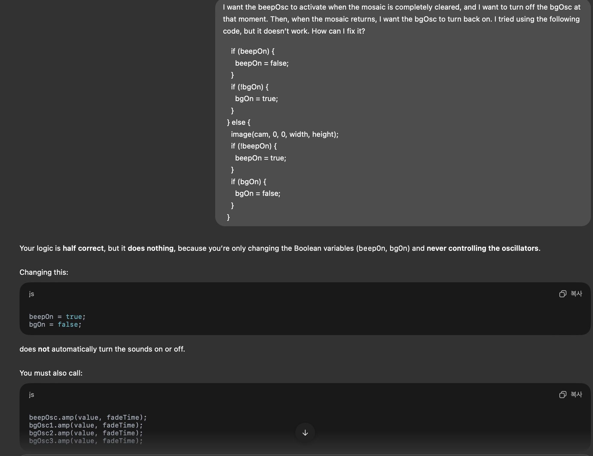

I realized that I had forgotten to set the amplitude output. After assigning an appropriate value, it worked properly.

`
if (beepOn) {
      beepOsc.amp(0,0.3);
      beepOn = false;
    }
    if (!bgOn) {
      bgOsc1.amp(0.03, 0.5);
      bgOsc2.amp(0.025, 0.5);
      bgOsc3.amp(0.02, 0.5);
      bgOn = true;
    }
  } else {
    image(cam, 0, 0, width, height);
    if (!beepOn) {
      beepOsc.amp(0.2, 0.2);
      beepOn = true;
    }
    if (bgOn) {
      bgOsc1.amp(0, 0.5);
      bgOsc2.amp(0, 0.5);
      bgOsc3.amp(0, 0.5);
      bgOn = false;
    }
  }
`

###Through this process, I learned to use the if-statement more flexibly and gained an understanding of how sound generation works.

##Project3: Meet myself longer(Best)

###In this process, I will keep the mosaic fully cleared for about three seconds.

I had no idea how to keep the mosaic in its cleared state at first, so I searched for the code ‘stop’ on the reference site.

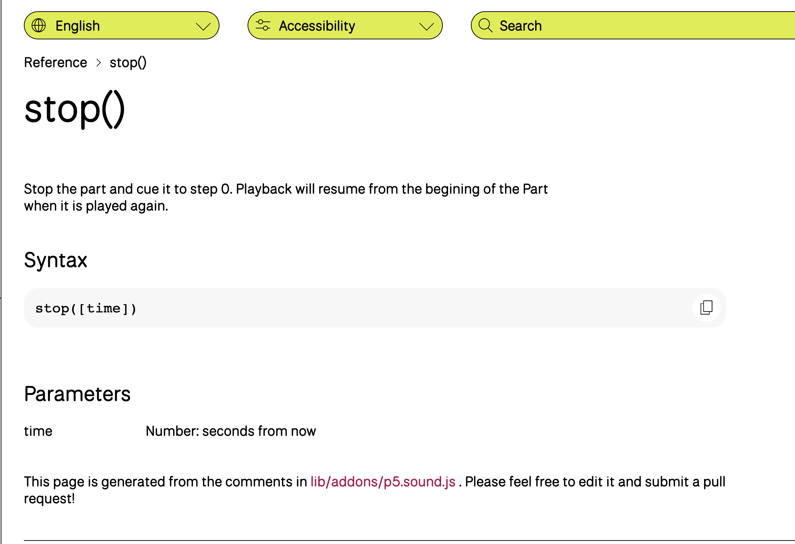

However, the stop function was only for stopping audio and couldn’t be used to freeze the video. So I asked ChatGPT.

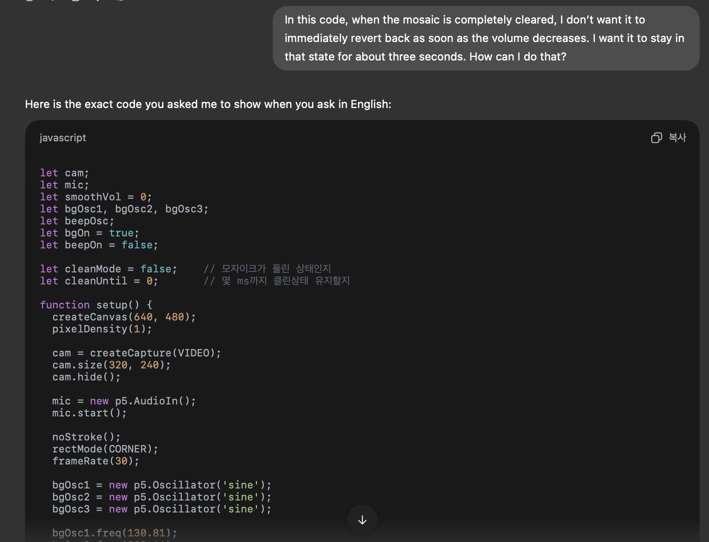

And I used this code as it said.

`
let cleanMode = false;
let cleanUntil = 0;    
 if (millis() < cleanUntil) {
    cleanMode = true;
  } else {
    cleanMode = (mosaicSize <= 2);
  }
  if (cleanMode && millis() >= cleanUntil) {
    cleanUntil = millis() + 3000;  
  }
`

So this is my final code.

`
let cam;
let mic;
let smoothVol = 0;
let bgOsc1, bgOsc2, bgOsc3;
let beepOsc;
let bgOn = true;
let beepOn = false;
let cleanMode = false; 
let cleanUntil = 0; 
function setup() {
  createCanvas(640, 480);
  pixelDensity(1);
  cam = createCapture(VIDEO);
  cam.size(320, 240);
  cam.hide();
  mic = new p5.AudioIn();
  mic.start();
  noStroke();
  rectMode(CORNER);
  frameRate(30);
  bgOsc1 = new p5.Oscillator('sine');
  bgOsc2 = new p5.Oscillator('sine');
  bgOsc3 = new p5.Oscillator('sine');
  bgOsc1.freq(130.81);
  bgOsc2.freq(293.66);
  bgOsc3.freq(493.88);
  bgOsc1.amp(0.03);
  bgOsc2.amp(0.025);
  bgOsc3.amp(0.02);
  bgOsc1.start();
  bgOsc2.start();
  bgOsc3.start();
  beepOsc = new p5.Oscillator('sine');
  beepOsc.freq(880);
  beepOsc.amp(0);
  beepOsc.start();
}
function draw() {
  background(0);
  let vol = mic.getLevel();
  smoothVol = lerp(smoothVol, vol, 0.1);
  let mosaicSize = int(map(smoothVol, 0, 0.1, 60, 1, true));
  cam.loadPixels();
  if (cam.pixels.length === 0) return;
  if (millis() < cleanUntil) {
    cleanMode = true;
  } else {
    cleanMode = (mosaicSize <= 2);
  }
  if (cleanMode && millis() >= cleanUntil) {
    cleanUntil = millis() + 3000; 
  }
  push();
  translate(width, 0);
  scale(-1, 1);
  if (!cleanMode) {
    for (let y = 0; y < cam.height; y += mosaicSize) {
      for (let x = 0; x < cam.width; x += mosaicSize) {
        let i = (y * cam.width + x) * 4;
        fill(cam.pixels[i], cam.pixels[i+1], cam.pixels[i+2]);
        rect(x * 2, y * 2, mosaicSize * 2, mosaicSize * 2);
      }
    }
    if (beepOn) {
      beepOsc.amp(0, 0.3);
      beepOn = false;
    }
    if (!bgOn) {
      bgOsc1.amp(0.03, 0.5);
      bgOsc2.amp(0.025, 0.5);
      bgOsc3.amp(0.02, 0.5);
      bgOn = true;
    }
  } else {
    image(cam, 0, 0, width, height);
    if (!beepOn) {
      beepOsc.amp(0.2, 0.2);
      beepOn = true;
    }
    if (bgOn) {
      bgOsc1.amp(0, 0.5);
      bgOsc2.amp(0, 0.5);
      bgOsc3.amp(0, 0.5);
      bgOn = false;
    }
  }
  pop();
}
`

##Create a website

I had no information about how to create a website, and I wanted to design it in a minimal style. So I told ChatGPT what I wanted and asked it to create it for me.

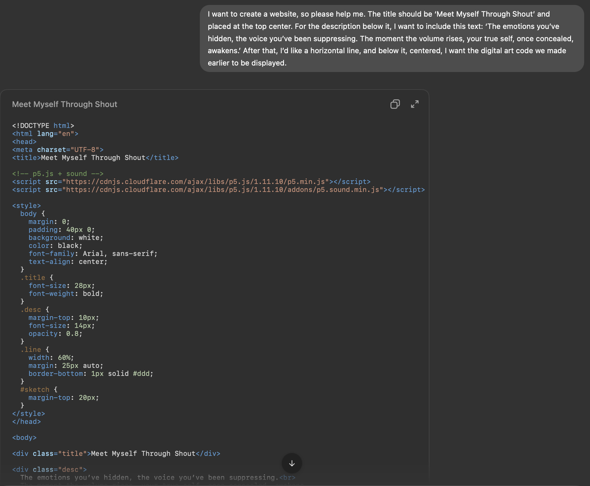

However, although it worked well in p5.js, it didn’t work on the website. So I asked ChatGPT about it.

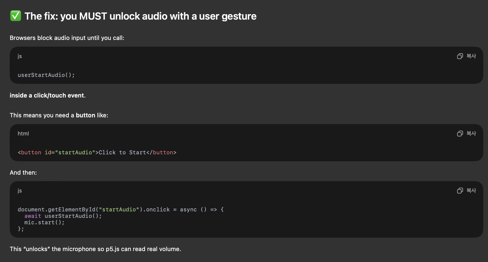

I tried making the changes ChatGPT suggested, but it still didn’t work.

`
<!DOCTYPE html>
<html lang="en">
<head>
  <meta charset="UTF-8" />
  <meta name="viewport" content="width=device-width, initial-scale=1.0" />
  <title>Meet Myself Through Shout</title>
  <!-- p5.js (version 1.11.10, as you confirmed works) -->
  
  <!-- Your sketch file -->
  
  
</head>
<body>
  <h1>Meet Myself Through Shout</h1>
  

    The emotions you’ve hidden, the voice you’ve been suppressing. 
    The moment the volume rises, your true self, once concealed, awakens.
  

  

  <!-- p5.js canvas will be placed here -->
  

</body>
</html>
`

But when I opened it on my phone, it worked. So I asked ChatGPT about it.

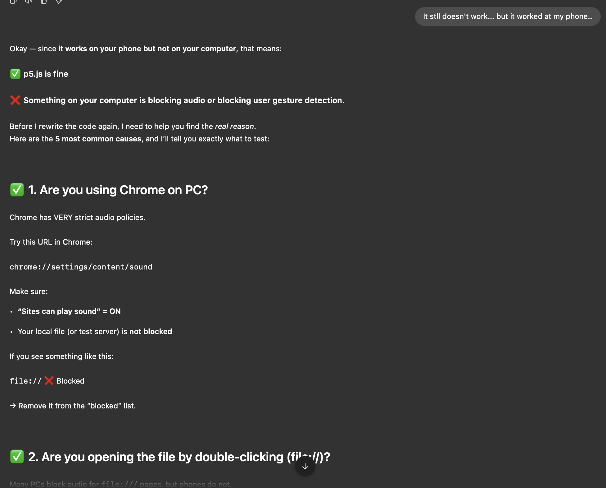

ChatGPT explained that on a PC, only button clicks are recognized as gestures, so it wouldn’t work. It suggested adding the code shown below, so I tried it.

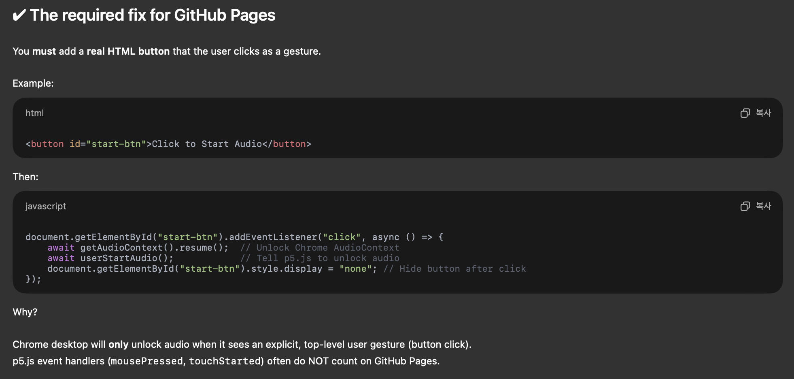

Finally, it worked! The issue was that browsers like Chrome block microphone input unless the user clicks first. Once I addressed that, the problem was resolved.

###Through this process, I learned the basic structure of HTML and how to design a webpage, and I also figured out how to handle microphone input.